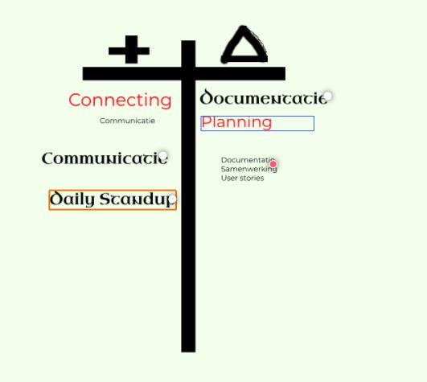
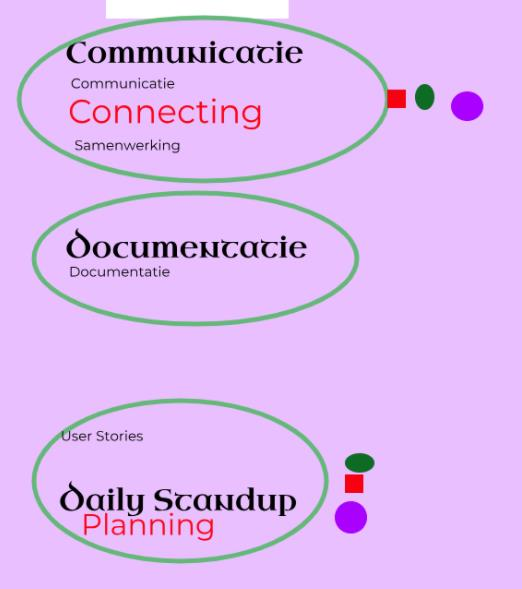
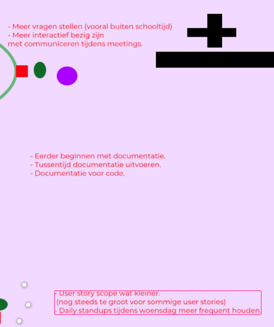

# Retrospective Semester 4 2025/04/24

## Selectie
Voor deze retrospective is gekozen voor het +△ methode. 
Deze methode werd gekozen omdat deze meer eenvoudiger leek en niet te veel extra's bevat, zoals tekeningen die meer detail verergeren.

## Uitvoering
#### Voorbereiding
Hiervoor hadden we de benodigde tekeningen op de website Magma getekend, deze was gekozen omdat het dan makelijker was om samen te tekenen aan het bord. 
Het tabel was eerst na getekent van de spotify retro kit.  

#### Invullen

##### Punten
We hadden het toen ingevult met wat goed vonden en wat nog verbetering nodig heeft. 
Bij de + waren de volgende woorden ingevult, 
connecting. 
Communicatie. 
Daily standup. 
Bij de △ waren de volgende woorden ingevult, 
Documentatie. 
Planning. 
Samenwerking. 
User Stories. 
##### Overleg
Toen we al de punten hadden ingevult hebben we toen aan elke lid van de team gevraagd over waarom die hebben gekozen voor deze punten.
###### Formaat
Punt: Uitleg. naam.
###### + punten
connecting: Hiermee word bedoelt met elkaar leren kennen. Daamin 
Communicatie: De rede hiervoor is dat er gecommuniceerd word wanneer dat moet. Lehan/Nicolaas 
Daily standup: Het gaat goed doordat de daily standups gedaan worden op een accepteerbaar manier. Lehan 
###### △ punten
Documentatie: Er was tijdens het sprint weinig gedaan aan Documentatie dit is iets wat verbetering nodig heeft. Lehan 
Planning: Deze was problematisch doordat er laat was door gegeven wat er nodig was voor de deliverabels. Daamin 
Samenwerking : Weinig tijd om aan het project te werken, buiten school niet veel samenwerking. Een teamlid is ziek laatste week van deze sprint. Nicolaas 
User Stories : Scope alsnog te groot voor veel user stories, te veel afhankelijkheden. Belangrijkste gedeelte (kunnen spelen in turns) niet in user stories gezet. Nicolaas 

##### Uitkomst

##### Groupering

Toen het vorige process afgerond was waren de punten toen in groepen gesorteert.
De groepen die gemaakt waren zijn.
- Communicatie
- Documentatie
- Planning
Nadat deze onderdeel afgerond was begonnen we met stemmen.

#### Stemmen

Voor het stemmen hadden we dot voting gedaan.
Met deze process hadt iedereen in het team gestemt op 2 onder delen die ze wilden op verbeteren.
#### Uitkomst

##### Verbeteren
Toen het stemmen process klaar was hadden we toen overlegt over hoe het verbetert moet worden.
Deze werd toen opgeschreven naast het stemmen
Voor de 3 onderdelen hadden we opgreschreven,
#### Communicatie
- Meer vragen stellen (vooral buiten schooltijd)
- Meer interactief bezig zijn met communicatie tijden meetings.
#### Documentatie
- Eerder beginnen met documentatie.
- Tussen tijd documentatie uit voeren
- Documentatie voor programeer code schrijven
#### Planning
- UserStory scopes meer specifiek maken.
- Dailystandups meer frequent te houden op een woensdag.
#### Uitkomst
