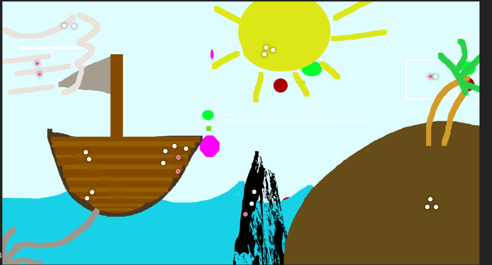
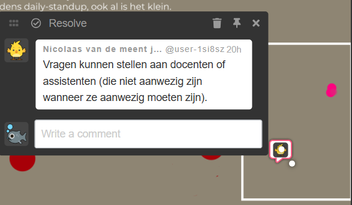
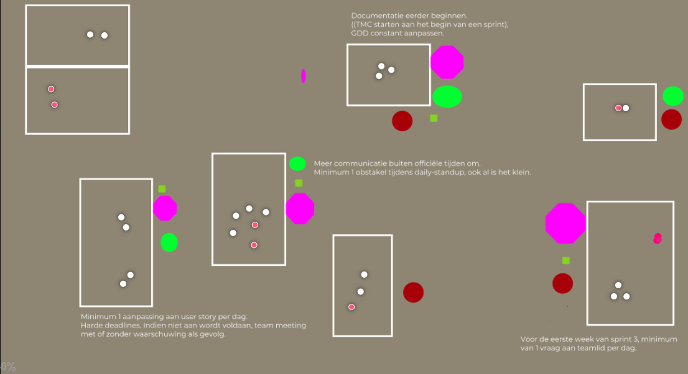

# Hoe we de retro hebben gedaan

Deze retro hebben we gedaan in Magama. Eerst stemden we over welke methode we gingen gebruiken. We kozen voor de **Sailboat-methode**.  
We tekenden de sailboat en bespraken elk onderdeel. Bij elk onderdeel plaatsten we comments die we passend vonden.

## De sailboat die we hebben getekend

{width=500}

## Hoe een comment eruitziet

{width=500}

---

# Follow-up actiepunten vorige periode

Na de retro hebben we in groepen actiepunten vastgesteld.

{width=500}

- Er zijn meer vragen gesteld deze sprint, maar het is nog niet op niveau;
- Meer doorvragen naar problemen die opkomen, en de daily stand-ups vaker houden;
- We zijn niet eerder begonnen met documentatie (TMC, GDD, Retrospective);
- Tussentijds was er niet genoeg documentatie;
- Er is een kleine hoeveelheid vooruitgang geboekt op de documentatie van code;
- Sommige user stories zijn specifieker gemaakt;
- De frequentie moet worden verbeterd, zowel voor maandag als woensdag op dit moment.
