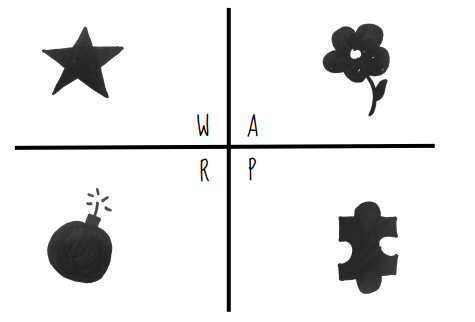
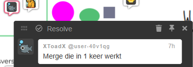
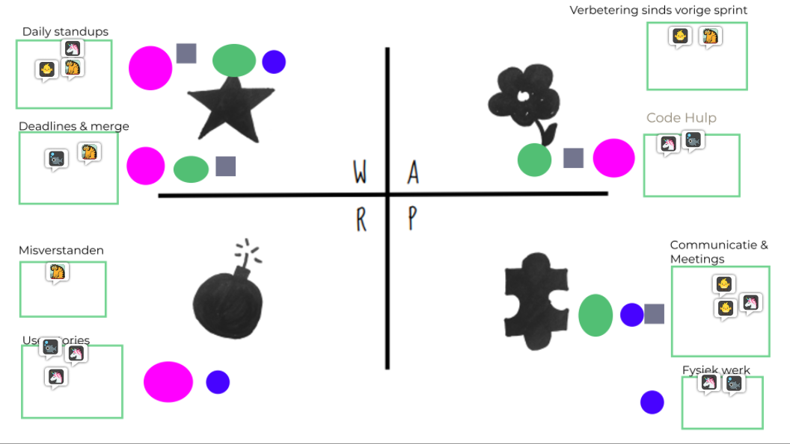

# Retrospective Sprint 3

## Actiepunten vorige retrospective:
- Tijdens sprint 3 hebben wij niet onszelf gehouden aan het constant aanpassen van de GDD en het eerder beginnen van de TMC;
- Er is tijdens sprint 3 geen vooruitgang gemaakt in het communiceren buiten officiële tijden om, wel zijn er meer obstakels aangegeven in de daily-standups;
- Er is een kleine hoeveelheid vooruitgang gemaakt in het vragen stellen gedurende de gehele periode;
- Vergeleken met sprint 2, waren er meer aanpassingen aan user stories in sprint 3. Sommige features hadden de hardere deadlines gehanteerd, maar voor de features die dat niet hebben gedaan, waren er geen consequenties.

## Reflectiemethode

Voor deze retrospective hebben we gebruikgemaakt van de WARP-method, uitgevoerd in Magma. De methode werd gekozen na een korte stemronde. Vervolgens werd de WARP tekening gekopieerd op een apart moodboard, en werd het stappenplan gevolgd. Hierbij gingen wij per onderdeel minimaal één comment plaatsen, die bij dat onderdeel hoort. Erna hebben wij als team de onderdelen verdeeld in aparte groepen, en op deze groepen gestemd (4 stemmen elk teamlid). Voor alle groepen met meer dan drie stemmen hebben wij een discussie gevoerd over actiepunten om de specifieke onderdeel te verbeteren. Actiepunten zijn ook als comments geplaatst.

### Gebruikte WARP tekening

### Hoe een comment eruitziet

### Groepering van comments

---

## Gezamenlijke Reflectie

De reflectie is in teamverband gedaan, waarbij we per onderdeel van de WARP tekening inzichten en opmerkingen hebben gedeeld. Hierdoor werd het duidelijk waar het goed en minder goed ging binnen het team.

### Wat ging goed?

- Teamleden waren actief in het bedenken van verbeterpunten;
- Er is meer gecommuniceerd dan in vorige periodes, hoewel hier nog meer verbetering in moet komen;
- Er is meer werk gedaan om user stories bij te houden;
- Er zijn vaker vragen gesteld vergeleken met vorige sprint, maar nog steeds niet genoeg.

### Wat ging minder goed?

- Documentatie (zoals TMC & GDD) werd niet bijgehouden;
- Er werd niet altijd goed doorgevraagd bij problemen;
- Daily stand-ups vonden niet consistent plaats;
- De planning werd niet altijd goed gevolgd of geëvalueerd.

---

## Actiepunten

- **Daily Stand-ups**  
  Elke werkdag volgens de gegeven tijden in het contract een daily-standup laten plaatsvinden, fysiek ofwel online.

- **Merge-deadline naar main**  
  Uiterlijk 2 dagen voor de sprintafsluiting worden alle branches gemerged naar de main branch. Hierdoor blijft er tijd over voor bugfixes en release naar een publishing platform.

- **User Stories controleren**  
  Tijdens de sprintplanning wordt er gezamenlijk gekeken of user stories aan de definitie van 'done' voldoen en worden deze samen afgemaakt.

- **Vragen eerder en transparanter stellen**  
  Teamleden stellen technische of organisatorische vragen in het algemene teamkanaal binnen Teams, zodat iedereen op de hoogte is. Dit gebeurt binnen één dag na het opkomen van een probleem.

- **Vaste wekelijkse meeting**  
  Eens per week vindt er een teamoverleg plaats, los van de dagelijkse stand-up, om de voortgang te bespreken en knelpunten aan te pakken. De dagen en tijden waarin dit gebeurt worden vastgelegd in het samenwerkingscontract.

- **Documentatie verbeteren**  
  Eens per week wordt een moment gepland om voortgang en volledigheid van documentatie te controleren (GDD, TMC, code).

---
## Gebruikte Tool

De retro werd gehouden met behulp van Magma, waarin we de WARP-methode visueel konden uitvoeren. Dit maakte het eenvoudig om per onderdeel van de methode gedachten toe te voegen en met elkaar te bespreken.

---

## Bronnen

- https://storage.googleapis.com/production-eng/1/2017/12/retro-kit3.pdf
