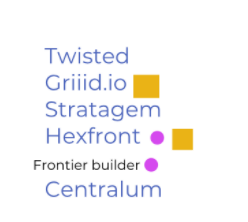
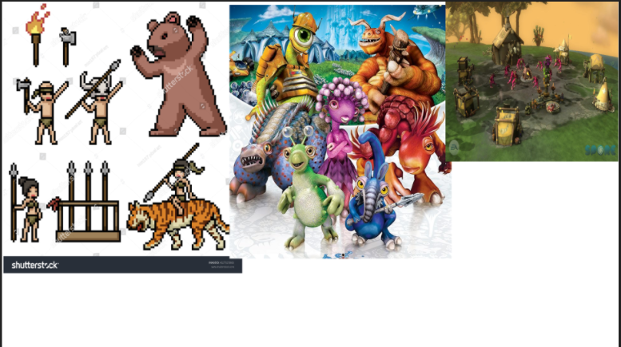
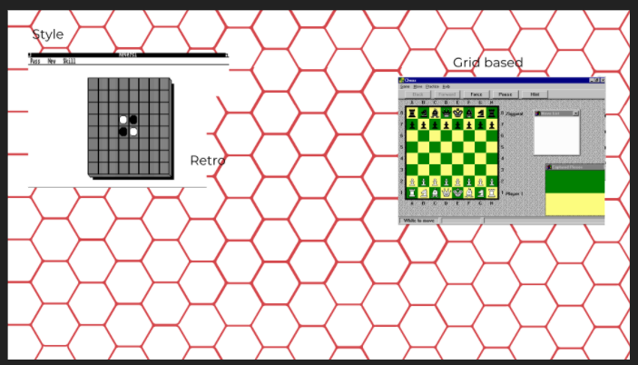
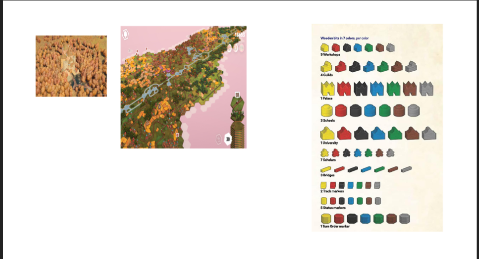
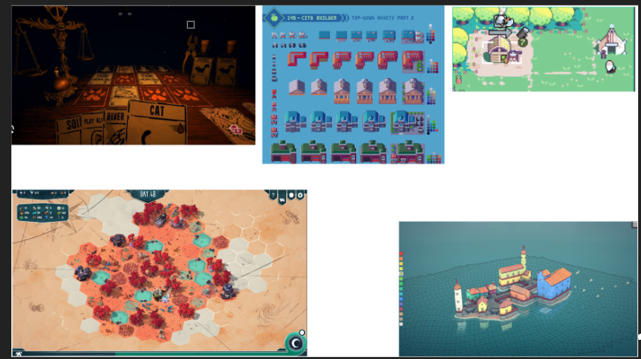
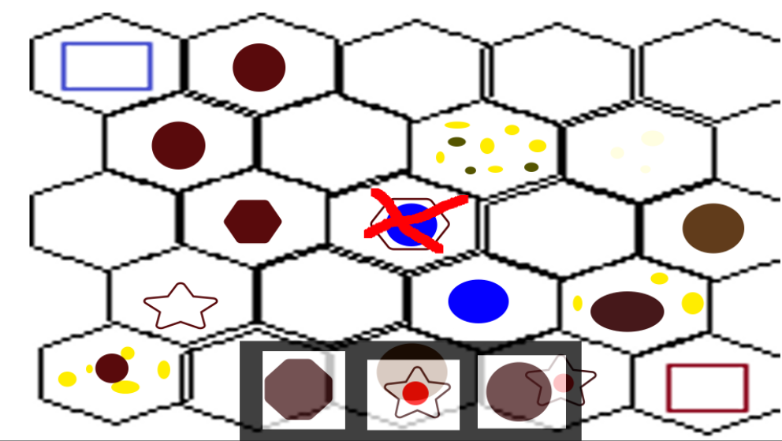
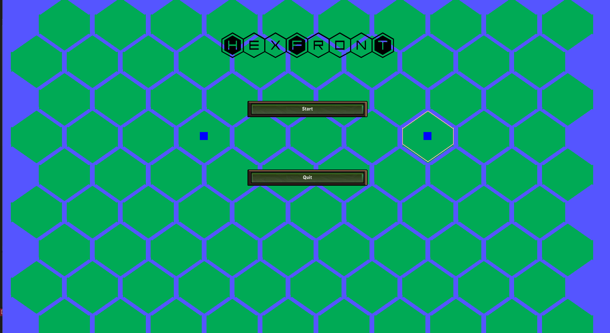

# TMC 1

## THINK

### Teamnaam 
Voor het bedenken van de spel naam was er eerst 2 minuten gegeven om namen te bedenken voor het spel. 
Toen deze stap gedaan werd er weer 2 minuten gegeven om te stemmen op welke naam we wilden iedereen kreeg mogelijkheid om op twee te stemmen.

### Inspiratie analyse:
We begonnen met het verzamelen van van inspiratie, hiervoor heeft iedereen een plek gekregen waar ze afbeeldingen van hun inspiratie voor de game in konden zetten zie afbeeldingen hieronder.

Moodboard Daamin

{width=500}

Moodboard Lehan

{width=500}

Moodboard Lieuwe

{width=500}

Moodboard Nicolaas

{width=500}

### Formal Elements:

#### Player:
- Player vs Player;

#### Objecties:
- Main Objective : Capture/Construction
- Outwit as;
- Per turn krijgt de speler verschillende pieces (met verschillende kosts) die de speler kan gebruiken;
- Centrale building die ca ptured moet worden;
- Win condition = Centrale building van tegenstander tot 0 hp krijgen of alle buildings van de tegenstander destroyen of enemy surrendert;

#### Procedures:
- Begin van het spel kiest de speler waar de centrale building wordt geplaatst binnen een bereik;
- Speler bouwt gebouwen op zijn turn van de gegeven pieces;
- Turn eindigen en dan speelt de tegenstander;
- Speler kan opgeven;

#### Rules:
- De speler kan alleen binnen het grid systeem acties uitvoeren;
- De speler kan niet troepen/gebouwen van de tegenspeler manipuleren;
- De speler kan per turn één gratis building bouwen, met de optie om meerdere buildings te bouwen indien mogelijk;
- Turn limit gebaseerd op tijd : 1 minuut;
- Gebouwen hebben een specifieke tile base nodig;
- Limiet van units is afhankelijk van gebouwde gebouwen;
- Als een gebouw wordt aangevallen, krijgt die schade;
- Als een gebouw kapot is, wordt de tile free gemaakt; Beschade gebouwen kunnen repaired worden;

#### Objecten:
- Resource gathering and Troop builder Buildings;

#### Resources:
- Levens (Central Building);
- Units (Buildings, troops);
- Health (Buildings);
- Currency (Resource 1, Resource 2, Resource);
- Special Terrain ();
- Time (Turn time); 

#### Conflicten

#### Obstacles:
- Weer verschijnselen;
- Speciaal terrein;
- Resource limiet op nodes (hierdoor kan de speler niet zoveel bouwen als die wilt);
#### Opponents:
- Tegenspeler;
#### Dilemmas:
- Beperkte hoeveelheid/soort buildings per turn die de speler kan bouwen;
- Soort building per grid tile;
- Geluk spelt een rol in welke buildings de speler kan bouwen;

#### Boundaries
- Het grid systeem;

#### Outcome
- Win/Lose condition;

### Core Mechanics:

#### Primary mechanics:
- Gebouwen bouwen op de grid;
- (Turn based)?;
#### Secondary mechanics:
- RNG gebouw beschikbaarheid;
- Troepen vallen automatisch gebouwen/andere troepen aan;

### Feedback Loops
- Positive feedback loop : Maak tegenspeler gebouwen kapot -> minder gebouwen van tegenspeler -> makkelijker om gebouwen van tegenspeler kapot te maken.
- Positive feedback loop : Gebouw bouwen -> krijgt resources -> meer gebouwen bouwen -> krijgt meer resources;
- Negatieve feedback loop : Je bouwt veel gebouwen (sterk) -> resource nodes raken op -> je hebt minder resources (zwak) -> je moet meer gebouwen buiten/resource nodes zoeken;
- Negatieve feedback loop : Je bent relatief sterk -> algemene kracht van aangeboden gebouwen wordt lager -> wordt zwakker -> algemene kracht van aangeboden gebouwen wordt hoger;

## MAKE 

### Paper Prototype
Voor het papier prototype was er eerst een bord getekent met zeshoeken. 
Toen werden er 2 vierkanten erop gezet die de functie van hoofd gebouw hadden. 
Toen dit werd gedaan was er een soort interface gemaakt waar al de bouwbare objecten op zaten. 
Er werd toen resource nodes toe gevoegt. 
Hiernaa werd er een soort playtest gedaan met het getekende versie. 

{width=500}

Tijdens het spelen werden er veranderingen toegevoegt aan de regels en veranderingen gebracht werden aan bestaande regels. 

#### Veranderingen

Na / tijdens de fysieke prototype-test hebben we geobserveerd en wijzigingen aangebracht in de regels, en dit genoteerd:

##### Game 1

- Speler 1 leek het spel beter te begrijpen dan speler 2.  
- Speler 1 plaatste heel snel al zijn resource collectors, terwijl speler 2 even nodig had om te volgen.  
- Troepen trainen was een beetje onduidelijk voor speler 1, maar hij kwam er uiteindelijk wel achter.  
- Speler 2 plaatste twee gebouwen op hetzelfde hexagon — dit mag niet. Dit moet duidelijker worden aangegeven.  
- Het bord is momenteel vrij klein, waardoor gebouwen van speler 1 en speler 2 tegen elkaar aan liggen.  
- Speler 2 plaatste zelfs een gebouw bovenop dat van speler 1.  
- Spelers lijken de combat-mechanic te begrijpen, al is het nog niet helemaal duidelijk.  
- De HP van gebouwen en de schade (damage) lijken niet in balans te zijn.  
- Kans op stalemates is groot met deze balans.  
- In het algemeen snappen spelers het spel, maar de balans van deze prototype moet beter.

#### Feedback

- Onduidelijk of je meer dan één building per tegel mag plaatsen.  
- Defence towers zijn te sterk.  
- Resources moeten beter verspreid worden.  
- Bewegen en aanvallen in een plusvorm is een leuk concept, maar de uitvoering is minder goed (door slechte balans).

#### Persoonlijke notities

- Misschien een limiet aan het aantal gebouwen instellen.  
- Of: mogelijkheid om een gebouw kapot te maken, waarna je er pas de volgende beurt weer iets op mag bouwen.  
- Defence towers zijn te sterk:
  - Ze zouden vijanden in 2 aanvallen moeten kunnen verslaan.  
  - Ze mogen maximaal 1 vijand per beurt uitschakelen.  
- Beweging en aanval in een plusvorm is een goed idee, maar moet beter worden uitgewerkt.

#### Concrete aanpassingen

- Towers mogen per beurt slechts **één unit** aanvallen in hun directe (1-tegel) omgeving.  
- Aanvallen gebeurt in een **plusvorm**, niet in een cirkel of vierkant.  
- Spelers kunnen een building **slopen**, waarna er **de volgende beurt** weer iets op die plek gebouwd mag worden.  
- Buildings mogen **alleen rondom je eigen gebouwen** geplaatst worden, en **niet op een tegel waar al een building staat** (voor zowel speler als vijand).  
- Troepen worden **geplaatst op de tile van de troop factory** (toevoegen aan handleiding).  
- Grotere focus op units voor volgende playtest.  
- Spelers focussen nu vooral op resource collection.  
- Bij het slopen van buildings krijg je **resources terug**, afhankelijk van het soort gebouw.

 
### Digitale versie

 
Bij deze foto is het ook zichtbaar hoe de hoofd menu eruit ziet met de logo van het spel.  
De achtergrond heeft als mogelijkheid om als een soort geheime mini game te kunnen werken. Het werkt als volgt je moet op elke plaat een vierkant plaatsen. 
Op deze grid kan je zien dat er op gebouwt is je kan dit zien door de bluawe vierkant wat op de twee cellen zijn. 
Deze grid kan ook een indicator geven voor wanneer de muis in een cell is. 
De cell is 1 van de zeshoeken in de grid. 

## CHECK
Voor de check hebben we een gdd peer review gedaan en dit is wat we hebben gekregen

# GDD: Peer Review Formulier

**Titel game: Hexfront**   
**Gemaakt door: Twister**  
**Gereviewd door: D.E.A.N**  

---

### **Identiteit**  
- Is de titel van de game pakkend en passend?  
- Is de teamnaam uniek en relevant voor hun concept?  
- Zijn de rollen van de teamleden duidelijk verdeeld?  

> _[De titel is passend, want het het gaat over hexen en Front is een oorlogs term. De teamnaam is uniek, maar niet relevant voor hun concept. Nee, want iedereen werkt aan alles.]_

---

### **Core Concept**  
- Is het duidelijk waar de game over gaat?  
- Is het concept origineel of herkenbaar?  
- Spreekt het idee aan? Waarom wel/niet?  

> _[Ja, want het wordt duidelijk beschreven in de GDD. Het is origineel, maar het neemt wel duidelijke inspiratie van andere games. Nee, want de game zou makkelijk te begrijpen zijn en de sessies zijn kort (wij hebben voorkeur voor langere sesssies)]_

---

### **Inspiratie Analyse**  
- Zijn de inspiratiebronnen duidelijk en goed onderbouwd?  
- Wordt er uitgelegd hoe deze inspiratie in de game wordt verwerkt?  
- Is er een eigen draai aan bestaande concepten gegeven?  

> _[Niet duidelijk, want er zijn geen fotos bij de inspiratiebronnen. Ja behalve de stijl van de game. Weersveranderingen zijn uniek alleen de rest is wat je verwacht in een Risk geinspireerde game.]_

---

### **Formal Elements**  
- Is het doel van de game duidelijk?  
- Is het duidelijk hoe de speler interaceert met het spel?  
- Zijn de procedures en regels logisch en goed uitgewerkt?  

> _[Het doel is niet perse duidelijk, want er wordt gezegd "Bouw een koninkrijk, leid je troepen, en vernietig het kasteel van je vijand" alleen hoe doe je dat precies? Nee, het is niet duidelijk hoe de speler interacteert met het spel. Geen uitleg gegeven.]_

---

### **Moodboard**  
- Geeft het moodboard een duidelijke indruk van de sfeer?  
- Past de gekozen stijl bij het core concept?  
- Sluiten de kleuren, vormen en beelden goed op elkaar aan?  

> _[Er is geen moodboard. Ja de stijl past erbij, want de inspiratie bron ziet er heel cozy uit. Niet van toepassing (geen moodboard)]_

---

### **Schetsen en/of Paper Prototype**  
- Geven de schetsen een goed beeld van de levels en gameplay?  
- Zijn de mechanics helder?  
- Lijkt het ontwerp speelbaar en begrijpelijk?  

> _[Niet van toepassing. Mechanics niet goed uitgelegd. Er is geen ontwerp waardoor het niet speelbaar klinkt en het is niet echt heel duidelijk.]_

---

### Algemene Feedback  
- **Wat werkt goed in dit Game Design Document?**  
  > _[Het logo. De Hexagon grid. De icoontjes per deelstuk maken de deelstukken duidelijk.]_
- **Welke drie concrete verbeterpunten zou je dit team aanraden?**  
  > _[Alles duidelijker uitleggen. Afbeeldingen gebruiken. Wat er minimaal in de GDD moet er in doen (formal elements missen).]_
- **Zijn er algemene inconsistenties of onduidelijkheden waar op gelet moet worden?**  
  > _[Het logo heeft meer aandacht gekregen dan het document.]_

